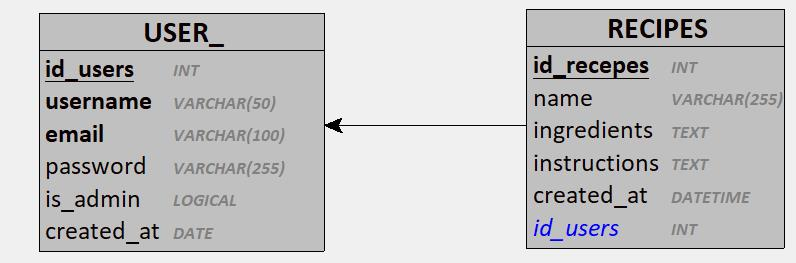

# Conception de la Base de Données avec Merise

## Règles de Gestion
1. Un utilisateur est identifié de manière unique par un identifiant (id).
2. Chaque utilisateur doit avoir un nom d'utilisateur unique et non vide.
3. Chaque utilisateur doit avoir une adresse email unique et valide.
4. Chaque utilisateur doit avoir un mot de passe non vide, haché avec bcrypt.
5. La date de création est enregistrée automatiquement.
6. Les données username, email, password sont obligatoires à l'inscription.
7. L'authentification nécessite un email et un mot de passe valides.
8. Les opérations CRUD (lecture, mise à jour, suppression) sont protégées par JWT.
9. Les mots de passe ne sont jamais retournés dans les réponses.
10. Les données sont stockées dans PostgreSQL.
11. Certains utilisateurs ont un rôle d'administrateur, leur donnant des privilèges supplémentaires.
12. L'accès à l'interface d'administration (ex. : GET /admin) est réservé aux administrateurs.
13. Le rôle d'administrateur est défini à la création et peut être modifié.
14. Une recette est toujours créée par un utilisateur.
15. Une recette a un nom, des ingrédients, des instructions de préparation.
16. Chaque recette peut être modifiée ou supprimée uniquement par son créateur (ou un admin).
17. Les recettes ont une date de création automatique.
18. Les utilisateurs peuvent consulter les recettes  des autres.

## Dictionnaire de Données

| Attribut     | Description                          | Type          | Contraintes                        | Commentaire                              |
|--------------|--------------------------------------|---------------|------------------------------------|------------------------------------------|
| id           | Identifiant unique                   | Entier        | Clé primaire, auto-incrémenté      | Généré par PostgreSQL                    |
| username     | Nom d'utilisateur                    | Chaîne (50)   | Non nul, unique                    | Choisi par l'utilisateur                 |
| email        | Adresse email                        | Chaîne (100)  | Non nul, unique, format email      | Utilisé pour l'authentification          |
| password     | Mot de passe haché                   | Chaîne (255)  | Non nul                            | Haché avec bcrypt                        |
| is_admin     | Indique si l'utilisateur est admin   | Booléen       | Non nul, défaut FALSE              | TRUE pour les administrateurs            |
| created_at   | Date de création                     | Timestamp     | Non nul, défaut CURRENT_TIMESTAMP  | Enregistré à l'inscription               |
| id	         | Identifiant unique	                  | Entier	      | Clé primaire, auto-incrémenté	     | Généré par PostgreSQL                    |
| user_id	     | Référence vers l’utilisateur	        | Entier	      | Clé étrangère (users.id), non nul	 | Créateur de la recette                   |
| name	       | Nom de la recette	                  | Chaîne (255)	| Non nul	                           | Titre visible                            |
| ingredients	 | Liste des ingrédients	              | Texte	        | Non nul	Format                     | texte ou JSON                            |
| instructions | Étapes de préparation	              | Texte         |	Non nul	                           | texte ou JSON                            |
| created_at	 | Date de création	                    | Timestamp	    | Non nul, défaut CURRENT_TIMESTAMP  | Automatique                              |


## MCD (Modèle Conceptuel de Données)
### Entité : USER
- **Identifiant** : id
- **Attributs** :
  - username : Chaîne, non nul, unique
  - email : Chaîne, non nul, unique
  - password : Chaîne, non nul
  - is_admin : Booléen, non nul, défaut FALSE
  - created_at : Date/Heure, non nul
- **Contraintes** :
  - Clé primaire : id
  - Unicité : username, email
- **Relations** :
  - Un utilisateur possède plusieurs recettes (1,N)
### Entité : RECIPE
- **Identifiant** : id
- **Attributs** :
  - name : non nul
  - ingredients : non nul
  - instructions : non nul
  - created_at : automatique
- **Relations** :
  - Une recette appartient à un seul utilisateur (N,1)
  
  

## MLD (Modèle Logique de Données)



### Table : users
```sql
CREATE TABLE users (
    id SERIAL PRIMARY KEY,
    username VARCHAR(50) NOT NULL UNIQUE,
    email VARCHAR(100) NOT NULL UNIQUE,
    password VARCHAR(255) NOT NULL,
    is_admin BOOLEAN NOT NULL DEFAULT FALSE,
    created_at TIMESTAMP DEFAULT CURRENT_TIMESTAMP
);

CREATE TABLE recipes (
    id SERIAL PRIMARY KEY,
    user_id INTEGER REFERENCES users(id) ON DELETE CASCADE,
    name VARCHAR(255) NOT NULL,
    ingredients TEXT NOT NULL,
    instructions TEXT NOT NULL,
    created_at TIMESTAMP DEFAULT CURRENT_TIMESTAMP
);
```